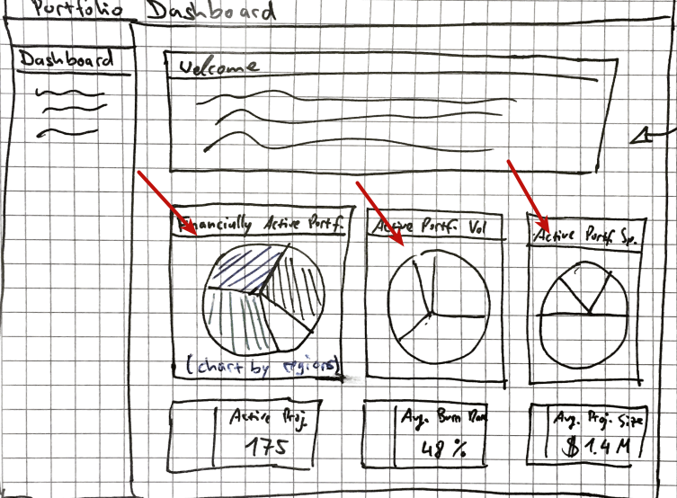
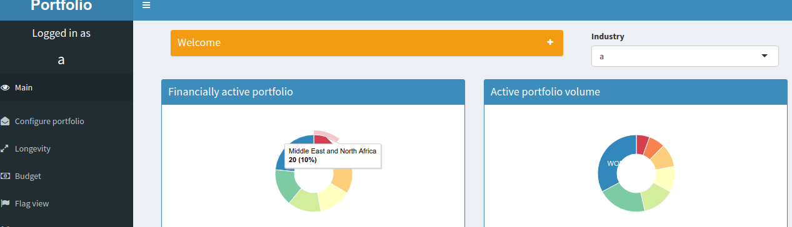

# Questions for Christian
2018-01-10

## Question 1: What are the pie charts on the landing page supposed to represent?

In the mock-up (see below image), there are three pie charts. They are named:
1. Financially active portf.
2. Active portf. Vol.
3. Active portf. sp.

What are the "full" titles of these charts (I don't unerstand "sp"), and what exactly are they supposed to show (ie, the sum by region of the `total_project_size` in the `as_portfolio` table...)?

Another way to address this question: to what extent do the charts I've implemented (see below) match up with your vision for this?

