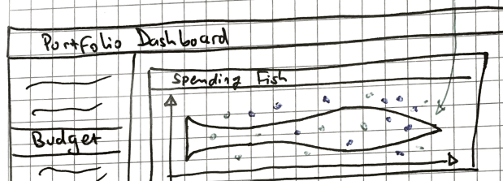

# Questions for Christian
2018-01-11

## Question 1: What are the pie charts on the landing page supposed to represent?

In the mock-up (see below image), there are three pie charts. They are named:
1. Financially active portf.
2. Active portf. Vol.
3. Active portf. sp.


What are the "full" titles of these charts (I don't unerstand "sp"), and what exactly are they supposed to show (ie, the sum by region of the `total_project_size` in the `as_portfolio` table...)?

Another way to address this question: to what extent do the charts I've implemented (see below) match up with your vision for this?


## Question 2: What should the "industry" filter refer to?

There is a filter in the upper right of the main page, which is supposed to "filter by industry" (see below). Which variable from `as_portfolio` should be used for this filter?


## Question 3: What does the "spending fish" refer to?

There is a "spending fish" chart on the "Budget" tab of the specs (see below). Does this chart have an already built equivalent in the old version of the app (my understanding is no). If not, what exactly is this chart supposed to show, and what is the data source for it (the `as_portfolio` table does not have time series transactions; is `as_results` the underlying data?)?



## Question 4: What are "flags" and how are they to be implemented?

The budget tab refers to "flags" (see below).


And, there is an entire tab meant to show "flags" (see below)


What are "flags", and how does one induce this from the raw data (ie, from the `as_results` or `as_portfolio` table)?

## Question 5: How to build data derivatives from the raw data?

In a previous email, you mentioned that the following three files were derivatives of the database:

```
longevity_data.csv
portfolio_funding_data.csv
portfolio_volume.csv
```

Where is the code used for the creation of these datasets? If they were not created programatically (ie, something like Excel was used), then can you provide instructions for how they should be created?

## Question 6: The database

The database, as I understand it, has only two tables: 
1. `as_results`
2. `as_portfolio`

My understanding is that the entire app should run off of only these two tables, plus the two flat files (which you mentioned in a previous email were manually created).

```
│   ├── factors.csv
│   ├── fig_ssa_addtional_details.csv

``
I also understand that `as_portfolio` gives details on each project (ie, one row per project), whereas `as_results` is basically a table of events related to each project (ie, many rows per project).

Is all of the above correct?