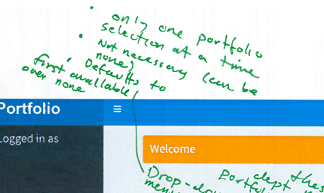
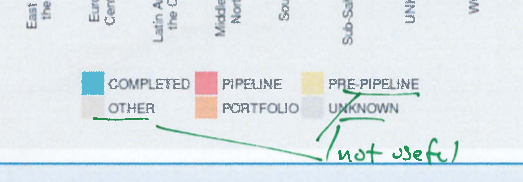
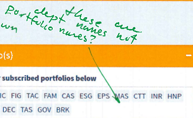
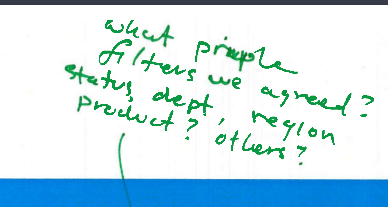
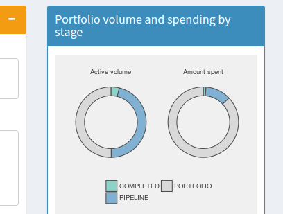

# Questions for Soren
2018-02-13

## Question 1: Portfolio selection - only one

In your comments (see below), you say that only one portfolio should be able to be selected at a time. This means that the app can't be used for aggregate analyses of multiple portfolios. From previous conversations, I had understood the opposite (that one of the goals was to be able to aggregate different portfolios to explore). Can you confirm that only one portfolio should be able to be selected at a time?

## Question 2: Portfolio selection - none

In the same comment (see above), you say that this selection is "not necessary" and that it can be "none". I don't understand. In this case, what does the user see? Are all the charts and tables then empty?

## Question 3: What to do with useless "Stage" categories

In your comment (see below), you say that certain "stage" categories aren't useful. Would you like me to manually hard-code a filtering of these in the app, or is this something that will be handled on the database side?

## Question 4: What are "portfolio names"

In your comment (see below), you point out that the names used for the "Select portfolio(s)" input refer to departments, not portfolios. I used the `primary_business_line_code` field to create these. This table reads directly from  the database (ie, whatever the "portfolio_name" field in the `portfolios` table is what will show up here). My assumption, therefore, is that I don't need to change anything here. Correct me if I'm wrong.

## Question 5: What are the fields for other other requested filters?

You mention that we should filter by "dept" and "product" (see below).
- By department, do you mean `owning_department_code`?
- By product, do you mean the semi-colon separated values of `business_line_product_pcts1`?

## Question 6: How to simplify the first page?

You mention that the charts on the first page are overly complex (by region, etc.) and suggest using simpler or pie style charts. Is this what you had in mind?  (see below)

## Question 7: How to calculate "amount spent"?  
 
In the above right-most chart, I am using the `total_fytd_expenditures` field for amount spent. Is there something else I should be using?

## Question 8: Database schema, etc.

(Not really a question) I've overhauled the documentation which covers how to build the database from scratch. Feel free to comment. [HERE](https://github.com/databrew/portfoliodash/tree/feature/mid_february#portfolio-dashboard)

## Question 9: What is the "start date" and "end date" for each project?

My understanding is that the `dataset_date` field is the date of observation for each product. For the spending fish, the x-axis will be the percentage of project completion, right? In this case, I need to know what the start date and end date for each project is, and it's not clear from the raw data what this would be.

(For start date, I could use earliest observation of `dataset_date`, but I'm wondering if there is a pre-first-observation date)

(For end date, I could use latest observation of `dataset_date`, but many projects have only one `dataset_date`)

## Question 10: What counts as "active"?

I'm currently considering as "active" any project whose `project_stage` is not "COMPLETED". But I'm not sure if this is correct. Is it?

